# Exploratory Data Analysis of Job Postings Using Python

## Introduction
In the rapidly evolving job market, understanding the landscape of job postings is crucial for job seekers, employers, and policymakers. This project focuses on analyzing job postings data using Python in Jupyter Notebook. By conducting an exploratory data analysis (EDA), the project aims to uncover trends and patterns that can provide valuable insights into the job market, specifically for data analyst positions.
## Objective
The primary objective of this project is to explore and analyze a dataset of job postings to identify key trends and patterns in the job market. The analysis will focus on various aspects such as the frequency of job titles, top companies posting jobs, popular job listing sources, job schedule types, salary rate types, and more. The goal is to provide a comprehensive overview of the job market landscape for data analyst roles.
## Task
1. Finding the Top Most Frequent Job Titles

2. Identifying the Top 10 Companies by Job Postings

3. Determining the Top 10 Job Listing Sources

4. Analyzing Job Schedule Types

5. Exploring Salary Rate Types

6. Distribution of Yearly, Hourly, and Standardized Salaries

7. Identifying Top Programming Languages for Data Analysts

8. Identifying Top Tools for Data Analysts

9. Distribution of Job Types

10. Analyzing the Distribution of Job Postings Offering Top Three Benefits
## Data & Resource Used

**Dataset**

Option 1: [Kaggle](https://www.kaggle.com/datasets?fileType=csv)

**Tools and Technologies** 

•	Programming Language: Python

•	Libraries: NumPy, Pandas, Matplotlib

•	Environment: Anaconda - Jupyter Notebook

## Methodology

The methodology involved several steps to explore and analyze the job postings dataset:

### 1. Data Cleaning and Preprocessing

Handling missing values, correcting data types, and standardizing text entries.
### 2. Exploratory Data Analysis (EDA)

o **Top Most Frequent Job Titles:** Identified the most common job titles in the dataset.

o **Top 10 Companies by Job Postings:** Analyzed which companies posted the most jobs.

o **Top 10 Job Listing Sources:** Determined the most common sources for job listings.

o **Job Schedule Types:** Examined the distribution of different job schedule types (e.g., full-time, part-time).

o **Salary Rate Types:** Explored the types of salary rates offered (e.g., yearly, hourly).

o **Distribution of Salaries:** Analyzed the distribution of salaries, including yearly, hourly, and standardized salaries.

o **Top Programming Languages for Data Analysts:** Identified the most frequently mentioned programming languages in job postings.

o **Top Tools for Data Analysts:** Determined the most commonly required tools for data analysts.

o **Distribution of Job Types:** Examined the distribution of various job types (e.g., permanent, contract).

o **Distribution of Job Postings Offering Top Three Benefits:** Analyzed the prevalence of benefits such as health insurance, retirement plans, and flexible working hours.

## Data Analysis & Key Findings
### Exploratory Data Analysis
• **Finding top most frequent job titles**

**Insight:** We can clearly notice that in Top 10 job posting maximum contribution jobs are different types of analyst. 

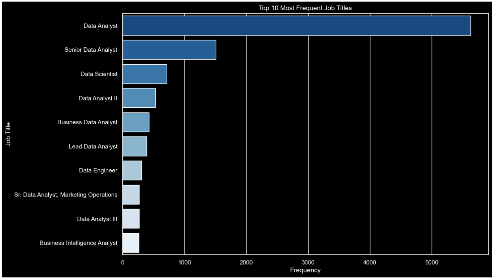

• **Looking for Top 10 Companies by Job Postings.**   

**Insight:** We can observe that different types of companies but based on above insight. Each companies need analyst.

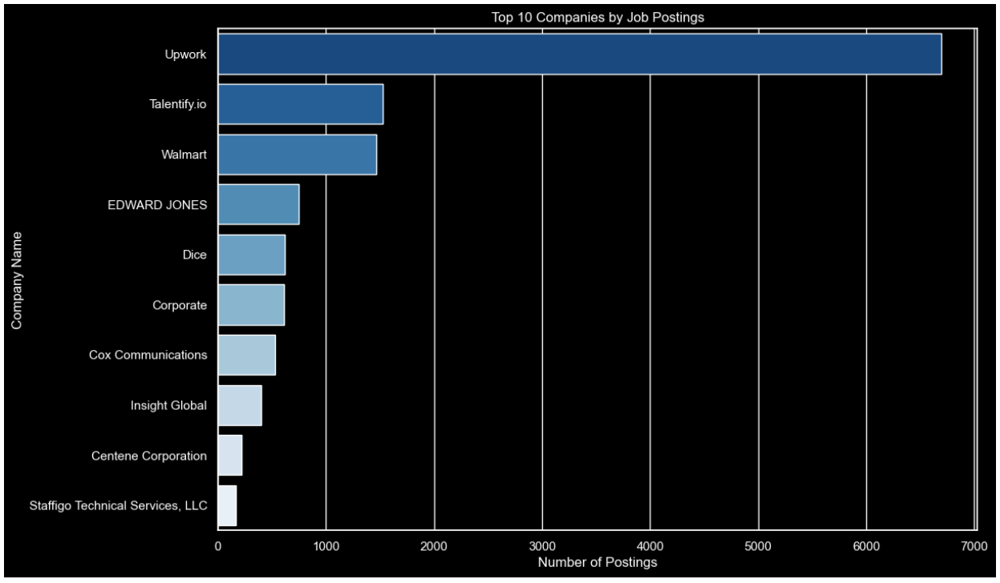  

• **Looking for Top 10 Job Listing Sources.**   

**Insight:** We can see that 1st is LinkedIn and 6th is Indeed.

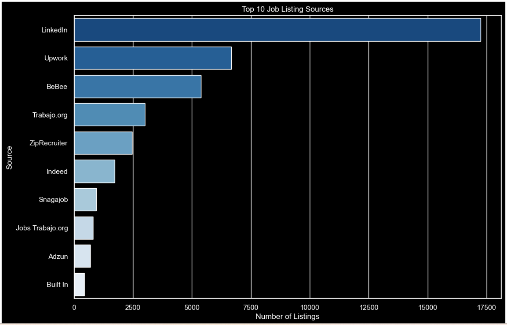  

• **Looking for Job Schedule Types.**   

**Insight:** We can see that there is n numbers of types.
		
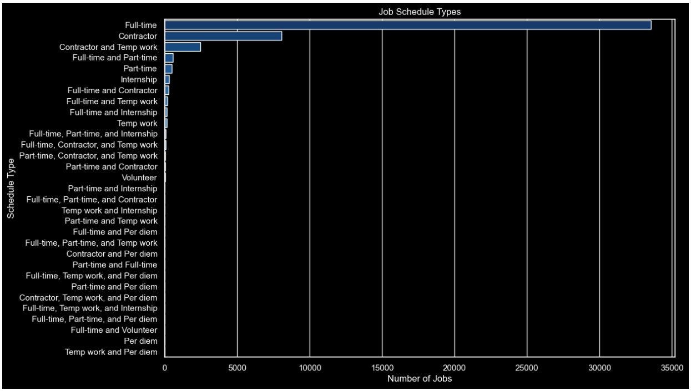 

• **Looking for Salary Rate Types.**   

**Insight:** Maximum rate type is an hour and next level is a year and very few have a month type.

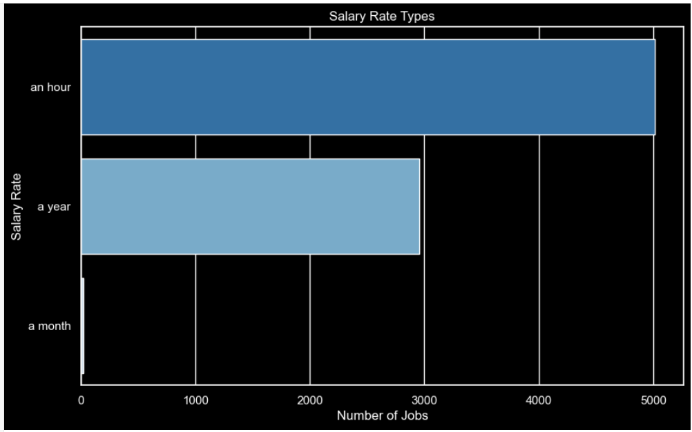

• **Looking for Distribution of Yearly, hourly, and Standardized Salaries.**   

**Insight:** Each have different average distribution. 

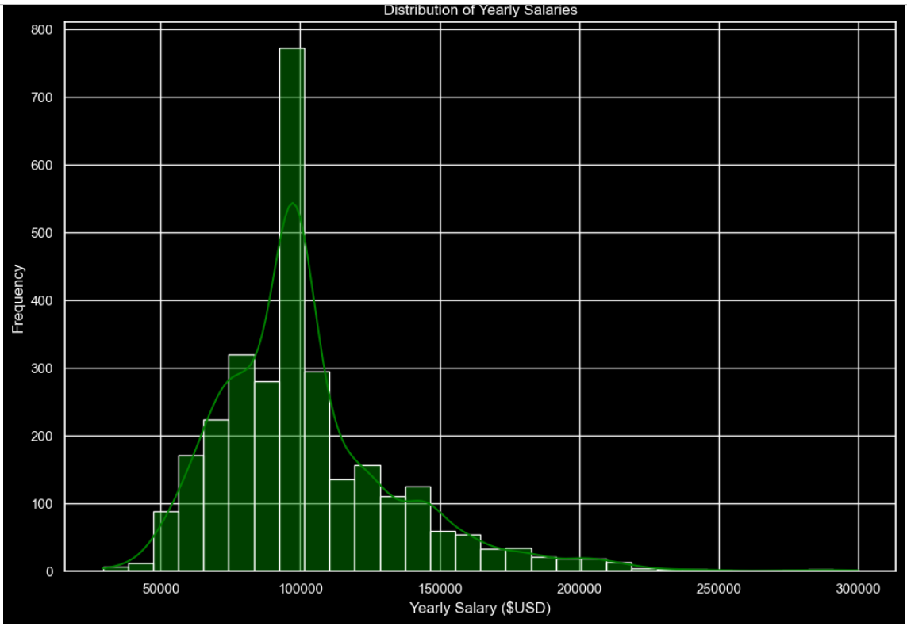 

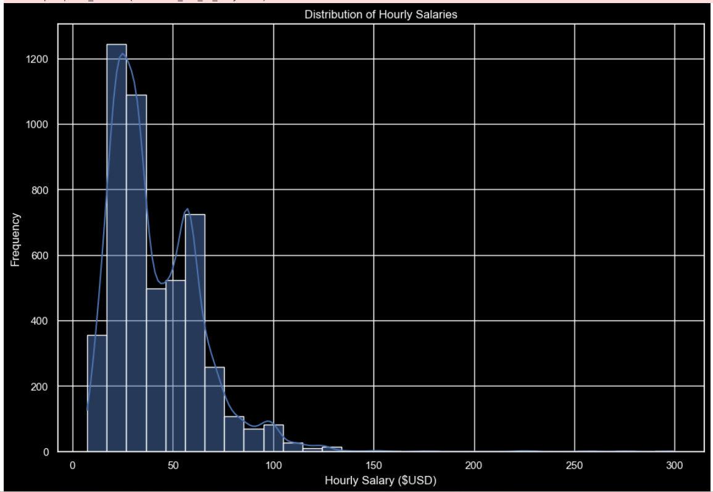 

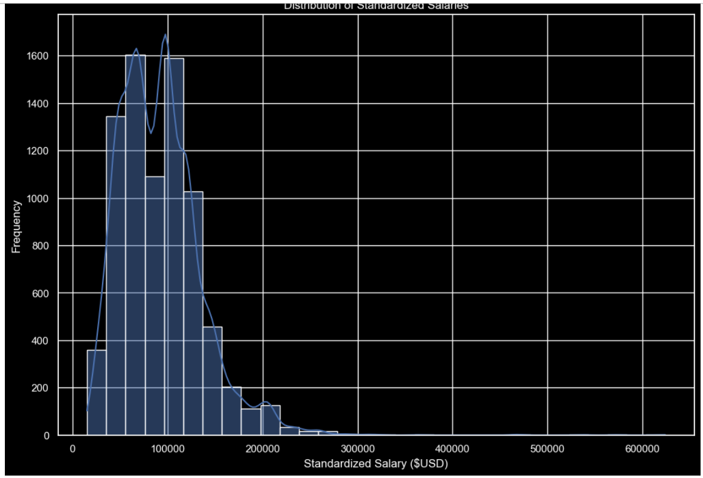 

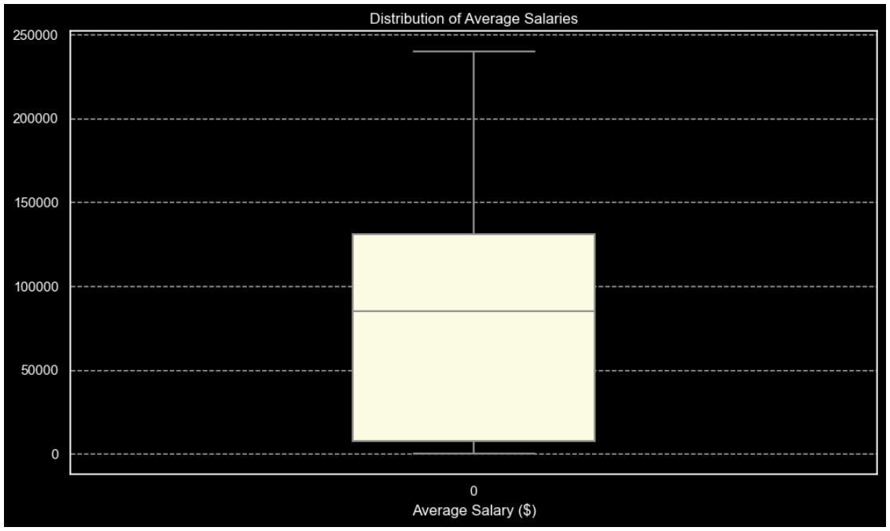

• **Looking for top programming languages for data analyst.**   

**Insight:** We can that R, Python and SQL are placed in top3.

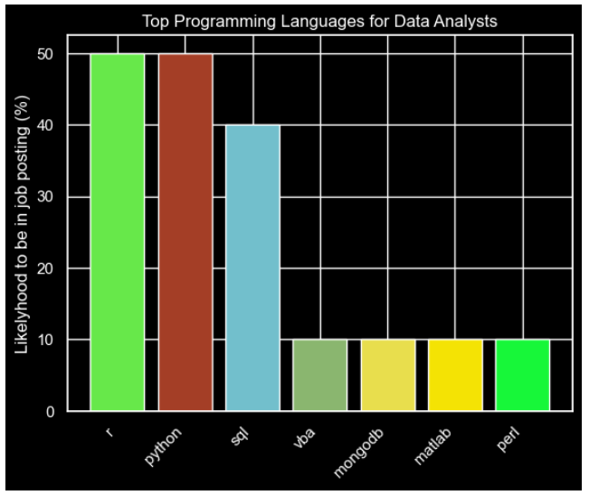  

• **Looking for top tools for data analyst.**   

**Insight:** We can that No:1 is Tableau.

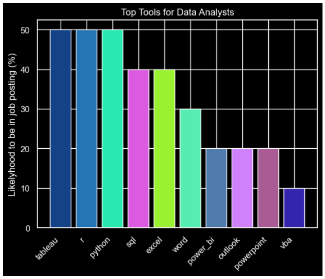

• **Looking for distribution of Job Types.**   

**Insight:** he vast majority of job postings are for full-time positions, with a significant portion also offering the option to work from home.

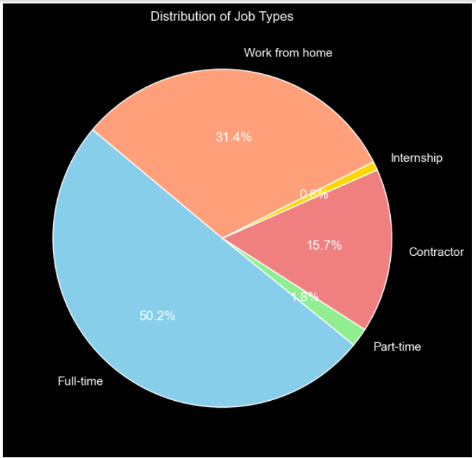

• **Finding the Distribution of Job Postings Offering Top Three Benefits.**   

**Insight:** While observe the outcome every company offers "Health Insurance".

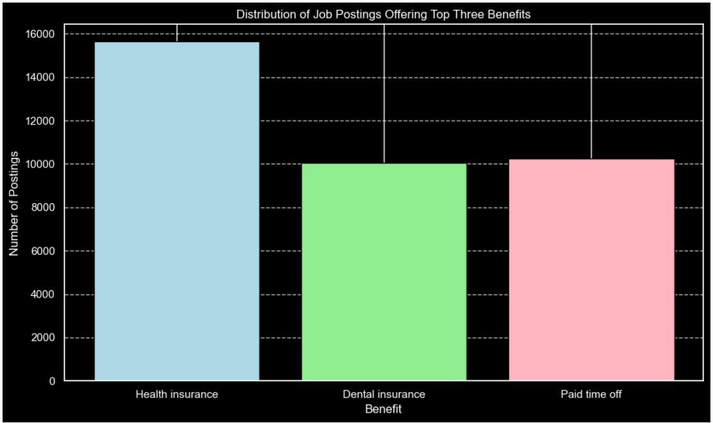 

## Conclusion
The analysis revealed several key insights into the job market for data analysts. The top job titles, companies, and job sources were identified, along with a detailed look at job schedules, salary structures, and the most in-demand skills. The findings provide a snapshot of the current job market landscape, highlighting the critical attributes and requirements for data analyst positions.
## Recommended Analysis
**Future analyses could include:**

**Predictive Modeling:** Use machine learning techniques to predict job market trends based on historical data.

**Sentiment Analysis:** Analyze job descriptions and reviews to gauge sentiment and identify desirable job attributes.

**Geographical Analysis:** Explore geographical trends in job postings, including regional demand for data analysts.

**Longitudinal Analysis:** Conduct a time-series analysis to observe changes in job market trends over time.	
## Reflection
This project successfully demonstrated the value of EDA in uncovering significant insights from job postings data. The use of Python and Jupyter Notebook facilitated efficient data processing and visualization. The findings provide a foundational understanding of the job market for data analysts, offering valuable information for various stakeholders. The comprehensive approach to data cleaning, analysis, and visualization ensured accurate and actionable insights, reflecting the importance of meticulous data analysis in understanding complex datasets.	
